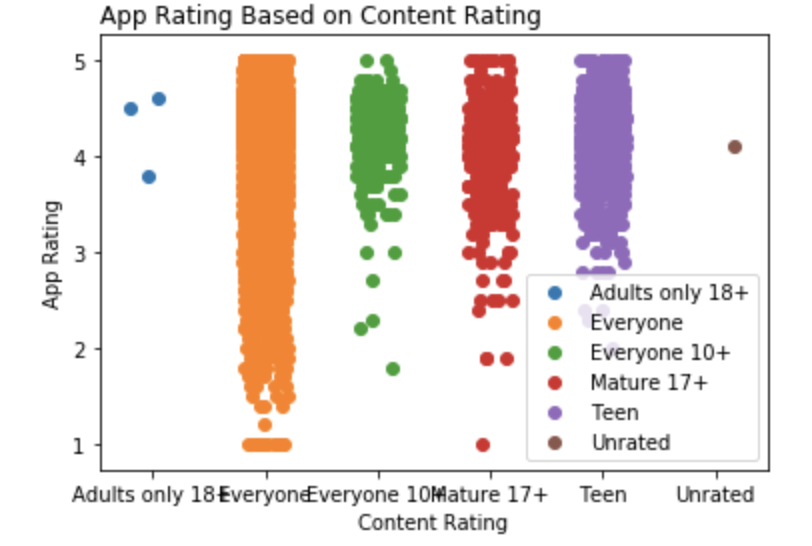
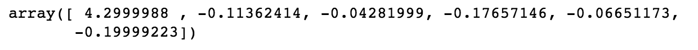

Hello and welcome to the second deliverable of my portfolio project on app store analytics and ratings of apps. This deliverable will be focused on model planning and building and working towards a predictive model to set me up for the final phase of the portfolio.

First I want to write a function called `include()` which will take a library that is already installed and load it but will download a package that is not installed on the machine that is running this file. Next I will load my packages needed for this deliverable.

```{r}
include <- function(library_name){
  if( !(library_name %in% installed.packages()) )
    install.packages(library_name) 
  library(library_name, character.only=TRUE)
}
include("knitr")
purl("deliverable1.Rmd", output = "deliv1.r")
source("deliv1.r")
include("caret")
include("tidyverse")
include("rvest")
include("ggplot2")
include("reticulate")
```

# Predictions from First Deliverable

Based off the first deliverable, I shifted my focus from how microtransactions affected app sales to how age ratings for apps affected their overall rating. Now knowing this, I would like to see if I can predict certain app analytics such as overall rating or ratings based on the latest update. These predictions will matter because if I can create a model that can predict the rating of an app based on its content rating, then future app developers can focus their content in that age rating for higher ratings and reviews of the app.

# New Data Source

After looking online, I found a json file of google play store app analytics. This is a different data type than my last data source which was a csv file. Using the `jsonlite` package, I will import the json file and then convert it to a data frame to begin tidying the data using the `as.data.frame` function. This data set will complement my first data source by adding Google Play Store data which is the other most popular app store other than the Apple App Store. This data source also has data for the amount of installs the app has which could be beneficial for analysis.

```{r}
googleimport <- jsonlite::fromJSON(txt = "data/googleplay.json")
asFrame <- as.data.frame(googleimport)
```

Now that the data is successfully loaded into the environment, it is time to tidy the data and get it ready for analysis.

# Tidying the Data

First, I need to understand the data set before I clean it. To do this I will explain the variables and their data types.

`App` is character data of the name of the app.

`Category` is character data of the genre of the app.

`Rating` is numeric data of the average rating of the app.

`Reviews` is numeric data of the amount of reviews for the app.

`Size` is numeric data for the size of the app in megabites and gigabites.

`Installs` is numeric data for the amount of installs the app has.

`Type` is character data for if the app is free or paid.

`Price` is character data for the price of the app.

`Content Rating` is character data for the age rating of the app.

`Genre` is character data for the genre of the app but `Category` will be kept instead.

`Last Updated` is the date in which the app was last updated.

`Current Ver` is character data for the current version of the app.

`Android Ver` is character data for the android version of the app.

## Checking the Variables for Odd Inputs

First I want to check all the variables for possible problems and then delete the problems.

```{r}
table(asFrame$Category)
```

After checking `Category`, I see that one response in this column is 1.9 so I will check into that to see the possible error. To do this I will use `filter()`.

```{r}
asFrame %>% filter(Category == "1.9")
```

Looking into this specific row, it seems as if the whole row is shifted left so I will delete this row.

```{r}
problem1 <- asFrame %>% filter(Category != "1.9")
```

Now that that row is taken out, I will move onto the next variable `Reviews`. I wanted to make sure that all entries in this column is a number so I will convert it to a character and then numeric so non number entries would turn to NA. Then I used `which()` to find out if any entries in the variable were non integers.

```{r}
problem1$Reviews <- as.numeric(as.character(problem1$Reviews))
which(!grepl('^[0-9]',problem1$Reviews))
```

The next problem I want to take care of is the `Installs` variable. I want to make this better for linear regression so I will manually make a new variable `Install_Group` where apps with 0-1000+ are category 1, 5000+ to 50000+ are category 2, 100000+ to 5,000,000+ are category 3, and lastly apps with 10,000,000+ downloads are category 4.

```{r}
problem1 <- problem1 %>% mutate(Install_Group = Installs)
problem1$Install_Group[problem1$Install_Group %in% c("0",
                                                   "0+",
                                                   "1+",
                                                   "10+",
                                                   "100+",
                                                   "50+",
                                                   "5+",
                                                   "500+", 
                                                   "1,000+")] <- "1"
problem1$Install_Group[problem1$Install_Group %in% c("5,000+",
                                                   "10,000+",
                                                   "50,000+")] <- "2"
problem1$Install_Group[problem1$Install_Group %in% c("100,000+",
                                                   "500,000+",
                                                   "1,000,000+",
                                                   "5,000,000+")] <- "3"
problem1$Install_Group[problem1$Install_Group %in% c("50,000,000+",
                                                   "10,000,000+",
                                                   "1,000,000,000+",
                                                   "100,000,000+",
                                                   "500,000,000+")] <- "4"
```

```{r}
table(problem1$Install_Group)
```

Now that the new variable has been made and the categories were made, I will make it into 4 different columns with inputs of 0 and 1 for linear regression.

```{r}
problem1 <- problem1 %>% mutate(cat1 = Install_Group == "1") %>% mutate(cat2 = Install_Group == "2") %>% mutate(cat3 = Install_Group == "3") %>% mutate(cat4 = Install_Group == "4")
problem1$cat1 <- as.numeric(problem1$cat1)
problem1$cat2 <- as.numeric(problem1$cat2)
problem1$cat3 <- as.numeric(problem1$cat3)
problem1$cat4 <- as.numeric(problem1$cat4)
```

Now that the `Installs` variable cleaning is over, I will now move on to `Content Rating`. I will do the same process with the multiple columns as above.

```{r}
table(problem1$`Content Rating`, useNA = "always")
```

```{r}
problem1 <- problem1 %>% mutate(adult = `Content Rating` == "Adults only 18+") %>% mutate(everyone = `Content Rating` == "Everyone") %>% mutate(everyone_10 = `Content Rating` == "Everyone 10+") %>% mutate(mature_17 = `Content Rating` == "Mature 17+") %>% mutate(teen = `Content Rating` == "Mature 17+") %>% mutate(unrated = `Content Rating` == "Unrated")
problem1$adult <- as.numeric(problem1$adult)
problem1$everyone <- as.numeric(problem1$everyone)
problem1$everyone_10 <- as.numeric(problem1$everyone_10)
problem1$mature_17 <- as.numeric(problem1$mature_17)
problem1$teen <- as.numeric(problem1$teen)
problem1$unrated <- as.numeric(problem1$unrated)
```

Now that all the variables have been cleaned that we need for the predictions, I will create a final tibble to be ready for analysis.

```{r}
google_play <- tibble(app_name = problem1$App,
                      genre = problem1$Category,
                      app_rating = problem1$Rating,
                      num_reviews = problem1$Reviews,
                      cat1 = problem1$cat1,
                      cat2 = problem1$cat2,
                      cat3 = problem1$cat3,
                      cat4 = problem1$cat4,
                      adult = problem1$adult,
                      everyone = problem1$everyone,
                      everyone_10 = problem1$everyone_10,
                      mature_17 = problem1$mature_17,
                      teen = problem1$teen,
                      unrated = problem1$unrated)
```

After creating the table, I realized that `app_rating` still has NA data for some of the rows so I will take out the rows where app_rating = NA.

```{r}
table(google_play$app_rating, useNA = "always")
```

```{r}
google_play <- google_play %>% filter(app_rating != "NaN")
```

# Performing Linear Regression

Now that the data is prepped and ready to observe in analysis, I will make a partition of the data for testing and predicting respectively. I want to predict the app_rating so I will create the partition on `app_rating`. The partition is splitting the data into two groups of randomly chosen data points where one group has 70% of the data and the other has 30%.

```{r}
sample_selection <- createDataPartition(google_play$app_rating, p=0.70, list = FALSE)
```

After creating the partition, I will make the training and the test data sets. The train set will be 70% of the data and will be used to make the model.

```{r}
train <- google_play[sample_selection,]
test <- google_play[-sample_selection,]
```

Now I will create the model using the 4 categories I made about amount of downloads and the 6 categories I made about content rating.

```{r}
train_model <- lm(app_rating ~ cat1 + cat2 + cat3 + cat4 + adult + everyone + everyone_10 + mature_17 + teen + unrated, data = train)
summary(train_model)
```

After seeing the results of the model, I see that `cat4`, `adult`, and `teen` were not defined bevause of singularities so in my revised model I will take those variables out.

```{r}
train_revised_model <- lm(app_rating ~ cat1 + cat2 + cat3 + everyone + everyone_10 + mature_17 + unrated, data = train)
summary(train_revised_model)
```

```{r}
predictions <- train_revised_model %>% predict(test)
R2(predictions,test$app_rating)
MAE(predictions,test$app_rating)
```

The r-squared value is the measure of how well our model can explain the variation in the test data. This means that our model can explain 3% of the variation in the test dataset.

The mean average error is a measure of the average length of distance both positive and negative from the actual point to the line our model makes. In this case the MAE is 0.35 stars out of 5.

# Exporting the Train Data for Python Analysis

Now that the model has been made in R, I want to make the model in python to where I can provide easier visuals for the model.

```{r}
python <- problem1 %>% filter(Rating != "NaN")
python_final <- tibble(app_rating = python$Rating,
                                  content_rating = python$`Content Rating`)
```

```{r}
write.csv(python_final,"data/python_model.csv", row.names = FALSE)
```

After importing the data into Python and creating a model this is the scatterplot that I produced of App Rating based on Content Rating within the google store data set. As you can see, the `Everyone` category has a wide spread of ratings and the `Everyone 10+` category has a less low rated apps.



These numbers are what the model predicts is the average rating of apps within each group of Content Rating. The first number is the average for the `Adults only 18+` category and the 5 following numbers are offsets relative to the first number. The following averages are calculated:

`Adults only 18+` = 4.29 Stars

`Everyone` = 4.18 Stars

`Everyone 10+` = 4.26 Stars

`Mature 17+` = 4.11 Stars

`Teen` = 4.23 Strs

`Unrated` = 4.10 Stars

# Limitations of the Model

In this case there are several limitations that the model suffers from. Certain values of Content Rating only have a few data points in them such as the Adults only category and the Unrated category. This model also suffers from external bias where apps are normally only reviewed if the user has an extreme experience with the app on both sides of the spectrum. Usual reviews are given 5 or 1 star for this reason because not everyone would take the time to review an app just to give 2 or 3 stars. This results in data that is skewed towards the higher end of the spectrum of reviews with most apps having an average rating of 4.5 or higher. As seen in the python model, most apps within each group of content rating have an average near 4.25 stars and this is because of the raw nature of voluntary response data.

